# Thinking Through the School Tutor Agent Architecture

## 🧠 Developer's Thought Process

This document captures the architectural thinking process for building a comprehensive AI-powered tutoring system from scratch. It's designed to help developers and architects understand the decision-making process behind every design choice.

## 1. System Requirements Analysis

### 🎯 Core Requirements
- **Primary Goal**: Create an AI tutor for 4th and 8th grade students
- **Subjects**: Mathematics, Science, English, Social Studies
- **Personalization**: Adapt to individual learning styles and pace
- **Scalability**: Support multiple students simultaneously
- **Evaluation**: Comprehensive assessment and progress tracking
- **Cost Efficiency**: Optimize AI model usage and infrastructure costs

### 🔍 Non-Functional Requirements
- **Performance**: Response time < 2 seconds
- **Availability**: 99.9% uptime
- **Security**: COPPA and GDPR compliance
- **Scalability**: Handle 1000+ concurrent students
- **Maintainability**: Easy to extend and modify

## 2. Architecture Decision Process

### 🏗️ High-Level Architecture Choices

#### Why Serverless Architecture?
**Decision**: Use AWS Lambda + API Gateway + DynamoDB

**Pros**:
- **Cost Efficiency**: Pay only for actual usage
- **Auto Scaling**: Handles traffic spikes automatically
- **Reduced Operations**: No server management
- **Fast Development**: Focus on business logic

**Cons**:
- **Cold Starts**: Initial latency for inactive functions
- **Vendor Lock-in**: AWS-specific implementation
- **Complex Debugging**: Distributed system challenges
- **Limited Control**: Less control over underlying infrastructure

**Alternative Considered**: Container-based (ECS/EKS)
- **Why Rejected**: Higher operational overhead, constant costs even with low usage

#### Why DynamoDB over RDS?
**Decision**: Use DynamoDB for all data storage

**Pros**:
- **Performance**: Single-digit millisecond latency
- **Serverless**: No database management
- **Scalability**: Handles millions of requests
- **Cost**: Pay per request model

**Cons**:
- **Limited Queries**: No complex joins or SQL
- **Learning Curve**: NoSQL mindset required
- **Data Modeling**: Requires careful design upfront

**Alternative Considered**: PostgreSQL RDS
- **Why Rejected**: Requires constant running costs, more complex for simple CRUD operations

### 🤖 AI Model Integration Choices

#### Why AWS Bedrock over OpenAI API?
**Decision**: Use AWS Bedrock with Claude models

**Pros**:
- **Integration**: Native AWS service integration
- **Privacy**: Data doesn't leave AWS ecosystem
- **Compliance**: Better for educational data
- **Cost Control**: Predictable pricing within AWS
- **Multiple Models**: Access to various AI models

**Cons**:
- **Limited Models**: Fewer options than OpenAI
- **Regional Availability**: Not available in all regions
- **Newer Service**: Less community knowledge

**Alternative Considered**: OpenAI GPT-4
- **Why Rejected**: Data privacy concerns, external API dependency

## 3. Code Architecture Design

### 📦 Project Structure Thinking

```
school-tutor/
├── backend/           # Core business logic
├── frontend/          # User interface (future)
├── evaluation/        # Assessment frameworks
├── docs/             # Documentation
└── dist/             # Build artifacts and temp files
```

#### Why Monorepo Structure?
**Decision**: Single repository with multiple packages

**Pros**:
- **Code Sharing**: Common utilities and types
- **Consistent Tooling**: Same build/test processes
- **Atomic Changes**: Update multiple packages together
- **Simplified Dependencies**: Easier dependency management

**Cons**:
- **Repository Size**: Can become large over time
- **Build Complexity**: More complex CI/CD pipelines
- **Permission Granularity**: Hard to restrict access per package

### 🏛️ Class and Interface Design Philosophy

#### Core Principles Applied:

1. **Single Responsibility Principle (SRP)**
   - Each class has one reason to change
   - StudentService only handles student operations
   - LearningEngine only handles content generation

2. **Dependency Inversion Principle (DIP)**
   - Depend on abstractions, not concretions
   - Use interfaces for external services (AWS, AI models)
   - Enable easy testing and service swapping

3. **Interface Segregation Principle (ISP)**
   - Small, focused interfaces
   - Clients don't depend on methods they don't use

#### Example: Student Management Design

```typescript
// ❌ Bad: Monolithic class
class StudentManager {
  createStudent() { /* ... */ }
  updateStudent() { /* ... */ }
  deleteStudent() { /* ... */ }
  generateContent() { /* ... */ }  // Wrong responsibility!
  trackProgress() { /* ... */ }    // Wrong responsibility!
}

// ✅ Good: Focused classes with clear responsibilities
interface IStudentRepository {
  create(student: Student): Promise<string>;
  findById(id: string): Promise<Student | null>;
  update(id: string, updates: Partial<Student>): Promise<void>;
  delete(id: string): Promise<void>;
}

interface IContentGenerator {
  generateLesson(student: Student, subject: string): Promise<Content>;
  generateQuiz(student: Student, topic: string): Promise<Quiz>;
}

class StudentService {
  constructor(
    private studentRepo: IStudentRepository,
    private validator: IStudentValidator
  ) {}
  
  async createStudent(data: CreateStudentRequest): Promise<string> {
    // Single responsibility: student lifecycle management
  }
}
```

**Why This Design?**
- **Testability**: Easy to mock dependencies
- **Flexibility**: Can swap implementations
- **Clarity**: Each class has a clear purpose
- **Maintainability**: Changes are localized

### 🔧 Library and Framework Choices

#### AWS CDK for Infrastructure
**Decision**: Use AWS CDK with TypeScript

**Pros**:
- **Type Safety**: Compile-time error checking
- **Code Reuse**: Infrastructure as code with programming constructs
- **AWS Integration**: First-class AWS service support
- **Version Control**: Infrastructure changes tracked in git

**Cons**:
- **Learning Curve**: Requires CDK knowledge
- **Complexity**: More complex than simple CloudFormation
- **Debugging**: Infrastructure debugging can be challenging

**Alternative Considered**: Terraform
- **Why Rejected**: AWS CDK provides better AWS-native experience

#### Evaluation Framework Selection
**Decision**: Multi-framework approach (Ragas, DeepEval, TruLens, Custom)

**Thinking Process**:
1. **No Single Perfect Framework**: Each has strengths and weaknesses
2. **Comprehensive Coverage**: Different aspects need different tools
3. **Redundancy**: Multiple measurements increase confidence
4. **Evolution**: Evaluation field is rapidly evolving

**Framework Breakdown**:
- **Ragas**: RAG-specific metrics (context relevance, faithfulness)
- **DeepEval**: General LLM evaluation (hallucination, bias)
- **TruLens**: Real-time monitoring and feedback
- **Custom**: Education-specific metrics (curriculum alignment)

## 4. Architecture Diagram

```mermaid
graph TB
    %% External Actors
    Student[👨‍🎓 Student]
    Teacher[👩‍🏫 Teacher]
    CLI[💻 CLI User]
    
    %% Frontend Layer (Future)
    Frontend[🌐 React Frontend<br/>Next.js + Amplify]
    
    %% API Gateway Layer
    API[🚪 API Gateway<br/>REST Endpoints]
    
    %% Core Services Layer
    subgraph "Core Services"
        StudentSvc[👤 Student Service<br/>Profile Management]
        LearningSvc[🧠 Learning Engine<br/>Content Generation]
        ProgressSvc[📊 Progress Tracker<br/>Analytics & Scoring]
        EvalSvc[🔍 Evaluation Service<br/>Quality Assessment]
    end
    
    %% AI/ML Layer
    subgraph "AI/ML Services"
        Bedrock[🤖 AWS Bedrock<br/>Claude Models]
        BedrockAgent[🎯 Bedrock Agent<br/>Orchestration]
    end
    
    %% Data Layer
    subgraph "Data Storage"
        StudentDB[(👥 Students Table<br/>DynamoDB)]
        ProgressDB[(📈 Progress Table<br/>DynamoDB)]
        EvalDB[(🔍 Evaluation Table<br/>DynamoDB)]
        MetricsDB[(📊 Metrics Table<br/>DynamoDB)]
        ContentS3[(📁 Content Bucket<br/>S3)]
    end
    
    %% Evaluation Framework
    subgraph "Evaluation Frameworks"
        Ragas[📋 Ragas<br/>RAG Evaluation]
        DeepEval[🔬 DeepEval<br/>LLM Metrics]
        TruLens[👁️ TruLens<br/>Monitoring]
        Custom[🎓 Custom<br/>Education Metrics]
    end
    
    %% Monitoring & Observability
    subgraph "Monitoring"
        CloudWatch[📈 CloudWatch<br/>Dashboards & Logs]
        Dashboard[📊 Evaluation Dashboard<br/>Streamlit]
    end
    
    %% Infrastructure
    subgraph "Infrastructure"
        CDK[🏗️ AWS CDK<br/>Infrastructure as Code]
        Lambda[⚡ Lambda Functions<br/>Serverless Compute]
    end
    
    %% Connections - User Interfaces
    Student --> Frontend
    Teacher --> Frontend
    CLI --> API
    Frontend --> API
    
    %% Connections - API to Services
    API --> StudentSvc
    API --> LearningSvc
    API --> ProgressSvc
    API --> EvalSvc
    
    %% Connections - Services to AI
    LearningSvc --> Bedrock
    LearningSvc --> BedrockAgent
    EvalSvc --> Bedrock
    
    %% Connections - Services to Data
    StudentSvc --> StudentDB
    ProgressSvc --> ProgressDB
    EvalSvc --> EvalDB
    LearningSvc --> ContentS3
    
    %% Connections - Evaluation
    EvalSvc --> Ragas
    EvalSvc --> DeepEval
    EvalSvc --> TruLens
    EvalSvc --> Custom
    
    %% Connections - Monitoring
    StudentSvc --> CloudWatch
    LearningSvc --> CloudWatch
    ProgressSvc --> CloudWatch
    EvalSvc --> CloudWatch
    EvalSvc --> Dashboard
    
    %% Connections - Infrastructure
    CDK --> Lambda
    CDK --> StudentDB
    CDK --> ProgressDB
    CDK --> EvalDB
    CDK --> MetricsDB
    CDK --> ContentS3
    CDK --> CloudWatch
    
    %% Styling
    classDef userClass fill:#e1f5fe,stroke:#01579b,stroke-width:2px
    classDef serviceClass fill:#f3e5f5,stroke:#4a148c,stroke-width:2px
    classDef aiClass fill:#fff3e0,stroke:#e65100,stroke-width:2px
    classDef dataClass fill:#e8f5e8,stroke:#2e7d32,stroke-width:2px
    classDef evalClass fill:#fff8e1,stroke:#f57f17,stroke-width:2px
    classDef infraClass fill:#fce4ec,stroke:#880e4f,stroke-width:2px
    
    class Student,Teacher,CLI,Frontend userClass
    class StudentSvc,LearningSvc,ProgressSvc,EvalSvc serviceClass
    class Bedrock,BedrockAgent aiClass
    class StudentDB,ProgressDB,EvalDB,MetricsDB,ContentS3 dataClass
    class Ragas,DeepEval,TruLens,Custom evalClass
    class CDK,Lambda,CloudWatch,Dashboard infraClass
```



## 5. Data Flow Analysis

### 🔄 Student Learning Session Flow

```mermaid
sequenceDiagram
    participant S as 👨‍🎓 Student
    participant API as 🚪 API Gateway
    participant LS as 🧠 Learning Service
    participant BR as 🤖 Bedrock
    participant PS as 📊 Progress Service
    participant DB as 🗄️ DynamoDB
    
    S->>API: Request learning session
    API->>LS: Start session
    LS->>DB: Get student profile
    DB-->>LS: Student data
    LS->>BR: Generate content
    BR-->>LS: Personalized content
    LS->>PS: Track interaction
    PS->>DB: Update progress
    LS-->>API: Content response
    API-->>S: Learning content
    
    Note over S,DB: Real-time personalization based on<br/>student profile and progress
```



### 📊 Evaluation Pipeline Flow

```mermaid
sequenceDiagram
    participant E as 🔍 Eval Service
    participant R as 📋 Ragas
    participant D as 🔬 DeepEval
    participant T as 👁️ TruLens
    participant C as 🎓 Custom
    participant DB as 🗄️ DynamoDB
    participant DASH as 📊 Dashboard
    
    E->>R: Run RAG evaluation
    R-->>E: Context metrics
    E->>D: Run LLM evaluation
    D-->>E: Quality metrics
    E->>T: Run monitoring
    T-->>E: Real-time feedback
    E->>C: Run education metrics
    C-->>E: Curriculum alignment
    E->>DB: Store results
    E->>DASH: Update dashboard
    
    Note over E,DASH: Comprehensive quality assessment<br/>across multiple dimensions
```



## 6. Error Handling Strategy

### 🛡️ Defensive Programming Approach

#### Principles Applied:
1. **Fail Fast**: Validate inputs early
2. **Graceful Degradation**: Provide fallbacks
3. **Circuit Breaker**: Prevent cascade failures
4. **Retry Logic**: Handle transient failures
5. **Comprehensive Logging**: Enable debugging

#### Example Implementation:

```typescript
// ❌ Bad: No error handling
async function generateContent(studentId: string, subject: string) {
  const student = await studentRepo.findById(studentId);
  const content = await bedrockService.generateLesson(student, subject);
  return content;
}

// ✅ Good: Comprehensive error handling
async function generateContent(
  studentId: string, 
  subject: string
): Promise<Result<Content, Error>> {
  try {
    // Input validation
    if (!studentId || !subject) {
      return Result.error(new ValidationError('Missing required parameters'));
    }
    
    // Circuit breaker check
    if (await circuitBreaker.isOpen()) {
      return Result.error(new ServiceUnavailableError('Service temporarily unavailable'));
    }
    
    // Fetch student with timeout
    const student = await withTimeout(
      studentRepo.findById(studentId),
      5000
    );
    
    if (!student) {
      return Result.error(new NotFoundError(`Student ${studentId} not found`));
    }
    
    // Generate content with retry logic
    const content = await withRetry(
      () => bedrockService.generateLesson(student, subject),
      { maxAttempts: 3, backoff: 'exponential' }
    );
    
    // Success case
    logger.info('Content generated successfully', { studentId, subject });
    return Result.success(content);
    
  } catch (error) {
    // Comprehensive error logging
    logger.error('Content generation failed', {
      studentId,
      subject,
      error: error.message,
      stack: error.stack
    });
    
    // Return appropriate error
    if (error instanceof TimeoutError) {
      return Result.error(new ServiceTimeoutError('Request timed out'));
    }
    
    return Result.error(new InternalServerError('Content generation failed'));
  }
}
```

## 7. Testing Strategy

### 🧪 Testing Pyramid Approach

#### Unit Tests (70%)
- **Purpose**: Test individual functions and classes
- **Tools**: Jest, TypeScript
- **Coverage**: >90% line coverage
- **Focus**: Business logic, edge cases, error handling

#### Integration Tests (20%)
- **Purpose**: Test service interactions
- **Tools**: Jest, AWS SDK mocks
- **Focus**: API endpoints, database operations, external services

#### End-to-End Tests (10%)
- **Purpose**: Test complete user workflows
- **Tools**: CLI automation, API testing
- **Focus**: Critical user journeys, system reliability

### 🎯 Test Design Philosophy

```typescript
// Example: Comprehensive test structure
describe('StudentService', () => {
  describe('createStudent', () => {
    it('should create student with valid data', async () => {
      // Happy path test
    });
    
    it('should validate required fields', async () => {
      // Input validation test
    });
    
    it('should handle database errors gracefully', async () => {
      // Error handling test
    });
    
    it('should not create duplicate students', async () => {
      // Business rule test
    });
  });
});
```

## 8. Performance Considerations

### ⚡ Optimization Strategies

#### Database Optimization
- **Single Table Design**: Minimize cross-table queries
- **Proper Indexing**: GSI for query patterns
- **Batch Operations**: Reduce API calls
- **Connection Pooling**: Reuse connections

#### Lambda Optimization
- **Memory Allocation**: Balance cost vs performance
- **Cold Start Reduction**: Keep functions warm
- **Bundle Size**: Minimize deployment packages
- **Concurrent Execution**: Control concurrency limits

#### AI Model Optimization
- **Prompt Engineering**: Optimize for cost and quality
- **Response Caching**: Cache common responses
- **Model Selection**: Choose appropriate model size
- **Batch Processing**: Group similar requests

## 9. Security Implementation

### 🔒 Security Layers

#### Authentication & Authorization
- **JWT Tokens**: Secure API access
- **IAM Policies**: Least privilege access
- **API Keys**: Rate limiting and access control

#### Data Protection
- **Encryption at Rest**: DynamoDB and S3 encryption
- **Encryption in Transit**: HTTPS/TLS everywhere
- **Data Anonymization**: Remove PII from logs

#### Input Validation
- **Schema Validation**: Validate all inputs
- **SQL Injection Prevention**: Parameterized queries
- **XSS Prevention**: Input sanitization

## 10. Deployment and DevOps

### 🚀 Deployment Strategy

#### Infrastructure as Code
- **AWS CDK**: Version-controlled infrastructure
- **Environment Separation**: Dev/Staging/Production
- **Automated Deployment**: CI/CD pipelines

#### Monitoring and Observability
- **CloudWatch**: Metrics and logs
- **Distributed Tracing**: Request flow tracking
- **Alerting**: Proactive issue detection

## 11. Future Considerations

### 🔮 Scalability Planning

#### Horizontal Scaling
- **Microservices**: Break down monolithic functions
- **Event-Driven Architecture**: Async processing
- **Caching Layer**: Redis/ElastiCache
- **CDN**: Global content distribution

#### Feature Expansion
- **Multi-Language Support**: Internationalization
- **Advanced AI**: Custom model training
- **Real-time Collaboration**: WebSocket support
- **Mobile Apps**: Native mobile applications

## 12. Lessons Learned

### 💡 Key Insights

1. **Start Simple**: Begin with MVP, iterate based on feedback
2. **Measure Everything**: You can't improve what you don't measure
3. **Plan for Failure**: Assume things will break
4. **Document Decisions**: Capture architectural reasoning
5. **Automate Early**: Automation pays dividends over time

### 🎯 Best Practices Applied

1. **Code Review**: All changes reviewed by peers
2. **Continuous Integration**: Automated testing and deployment
3. **Feature Flags**: Safe feature rollouts
4. **Version Control**: Git-based workflow
5. **Documentation**: Keep docs up-to-date

This thinking document serves as a guide for current and future developers working on the School Tutor Agent system, helping them understand not just what was built, but why it was built that way.
